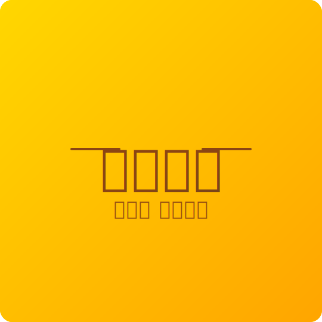

# 🎨 시티반점 로고 이미지 가이드

## 📁 생성된 로고 파일

1. **logo.svg** - 메인 로고 (장식 패턴 포함)
   - 금색 배경
   - "시티반점" 메인 텍스트
   - "中화요리" 서브 텍스트
   - 중국풍 장식 요소

2. **logo-simple.svg** - 간단한 버전
   - 깔끔한 디자인
   - "시티반점" 메인 텍스트
   - "맛있는 중국요리" 서브 텍스트

## 🔄 로고 변경 방법

### HTML에서 로고 변경

`backend/public/order-new/index.html` 파일의 65번째 줄:

```html
<!-- 현재 -->


<!-- 다른 로고 사용 -->

```

### SVG 로고 수정

1. `logo.svg` 또는 `logo-simple.svg` 파일을 텍스트 에디터로 열기
2. 색상 변경:
   - `#FFD700` → 금색 배경
   - `#8B4513` → 갈색 텍스트
   - `#FF6B00` → 주황색 장식
3. 텍스트 변경:
   - `font-size="80"` → 글자 크기
   - `시티반점` → 메인 텍스트
   - `맛있는 중국요리` → 서브 텍스트

## 🎨 로고 디자인 특징

- **색상**: 금색(#FFD700) 배경, 갈색(#8B4513) 텍스트
- **폰트**: Gowun Batang, Noto Serif KR
- **크기**: 540x540px
- **형식**: SVG (벡터, 확대해도 깨지지 않음)

## 📝 PNG로 변환하는 방법

SVG를 PNG로 변환하려면:

1. **온라인 변환 도구**:
   - https://cloudconvert.com/svg-to-png
   - https://convertio.co/kr/svg-png/

2. **브라우저에서**:
   - SVG 파일을 브라우저로 열기
   - 스크린샷 찍기
   - 이미지 편집 프로그램으로 크기 조정

3. **명령어 (ImageMagick 설치 필요)**:
   ```bash
   magick logo.svg -resize 540x540 logo.png
   ```

## ✅ 현재 설정

HTML에서 `logo.svg`를 사용하도록 설정되어 있습니다.
로고가 보이지 않으면 `logo-simple.svg`로 자동 전환됩니다.

